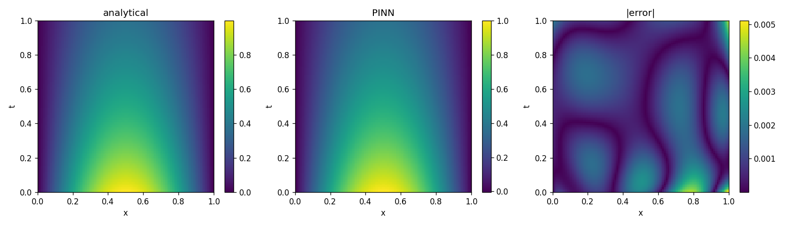
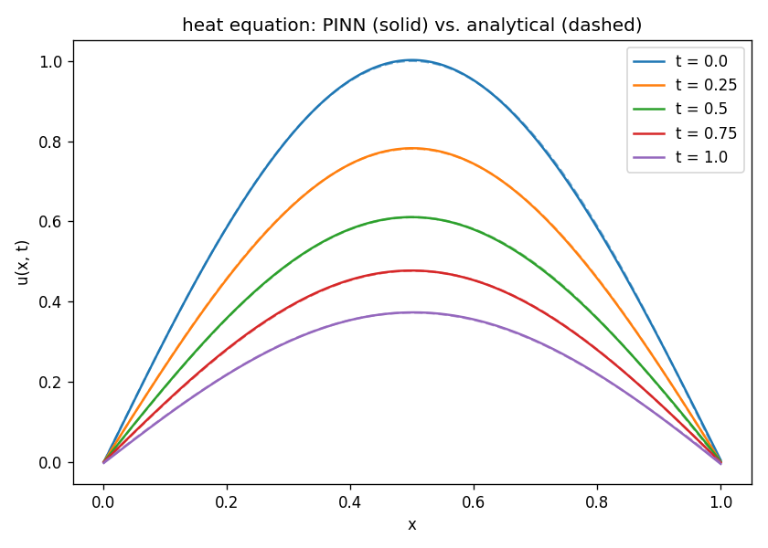
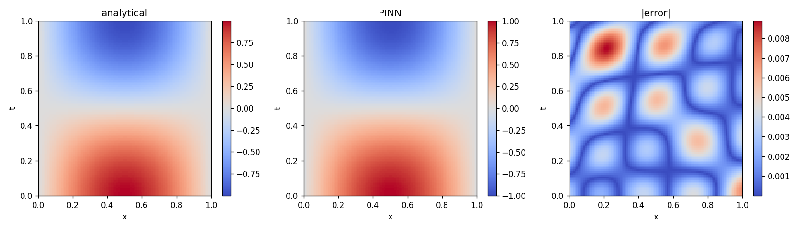
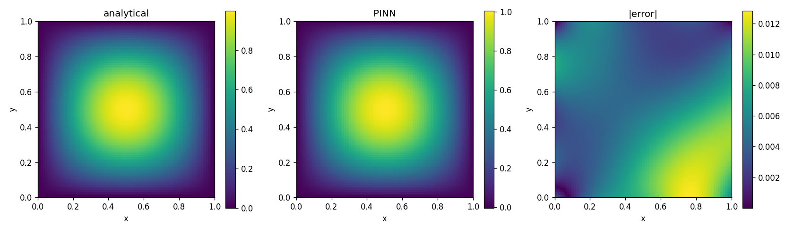
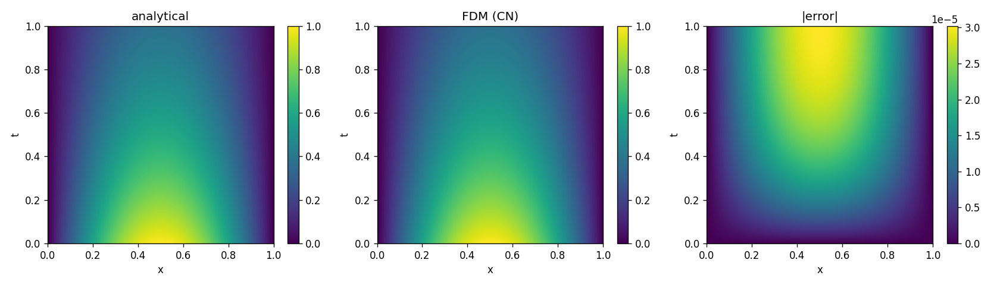

# pinn-solver

Solving PDEs with Physics-Informed Neural Networks (PINNs). Based on the approach in Raissi, Perdikaris, Karniadakis (2019): *Physics-informed neural networks*.

Three PDEs are solved: the 1D heat equation, the 1D wave equation, and the 2D Poisson equation. For the heat equation there is also a classical finite-difference solver (Crank-Nicolson) included as a baseline.

## What a PINN is

A PINN is a small fully connected network $u_\theta(x, t)$ trained to approximate the solution of a PDE. It has no training data in the usual sense. Instead, you sample collocation points in the domain and on the boundary, and define a loss that punishes:

1. Violation of the PDE at interior points (the PDE residual).
2. Disagreement with the boundary condition at boundary points.
3. Disagreement with the initial condition at $t = 0$.

Because the network is smooth, we can differentiate its output analytically using PyTorch autograd. So computing $u_t$, $u_{xx}$, etc. is just a call to `torch.autograd.grad`.

For the 1D heat equation with $u_t = \alpha u_{xx}$ and homogeneous Dirichlet BCs, the loss is

$$\mathcal{L}(\theta) = \frac{1}{N_f} \sum_{i=1}^{N_f} \left| u_t - \alpha u_{xx} \right|^2 \;+\; w_b \cdot \frac{1}{N_b} \sum |u(x_b, t_b)|^2 \;+\; w_i \cdot \frac{1}{N_i} \sum |u(x_i, 0) - u_0(x_i)|^2$$

The weights $w_b, w_i$ matter more than you'd expect — without them the PDE residual term dominates and the network barely fits the boundary.

## The problems

**1D heat equation** — `heat.py`

$$u_t = \alpha\, u_{xx}, \quad x \in [0,1],\; t \in [0,1]$$

With $u(0,t) = u(1,t) = 0$ and $u(x,0) = \sin(\pi x)$, the analytical solution is

$$u(x, t) = e^{-\alpha \pi^2 t} \sin(\pi x).$$

**1D wave equation** — `wave.py`

$$u_{tt} = c^2 u_{xx}$$

With homogeneous Dirichlet BCs, $u(x,0) = \sin(\pi x)$, $u_t(x,0) = 0$, the analytical solution is

$$u(x, t) = \cos(c \pi t) \sin(\pi x).$$

The two initial conditions ($u$ and $u_t$) are both enforced in the loss. The $u_t$ part needs a `torch.autograd.grad` call at $t = 0$.

**2D Poisson equation** — `poisson.py`

$$-(u_{xx} + u_{yy}) = f(x, y), \quad (x, y) \in (0, 1)^2, \quad u = 0 \text{ on } \partial\Omega$$

With $f = 2\pi^2 \sin(\pi x) \sin(\pi y)$, the solution is $u = \sin(\pi x)\sin(\pi y)$.

## Results

Numbers from running on my laptop (CPU only, seeds fixed):

| Problem | Method | L2 error |
|---|---|---|
| 1D heat equation | PINN (5000 epochs) | 1.15e-3 |
| 1D heat equation | Crank-Nicolson FDM (101 x 1001 grid) | 1.64e-5 |
| 1D wave equation | PINN (6000 epochs) | 2.91e-3 |
| 2D Poisson equation | PINN (8000 epochs) | 6.55e-3 |

Plots are in `figures/`.

### 1D heat equation

PINN vs. analytical, full $(x, t)$ domain:



Slices at fixed times (solid = PINN, dashed = analytical — overlap almost perfectly):



### 1D wave equation



### 2D Poisson equation



### Classical FDM baseline for the heat equation



## FDM vs. PINN

For the heat equation on this simple domain, the classical FDM wins on every axis:

- FDM L2 error is ~1.6e-5 on a $101 \times 1001$ grid.
- PINN L2 error sits around 1e-3 after 5-6k epochs.
- FDM solves in under a second. PINN training takes a few minutes on CPU.

That is expected. PINNs become more interesting when:

- The domain is irregular (meshing is annoying).
- There is no easy grid-based method.
- You want to solve an inverse problem (recover a parameter from data).
- You need a continuous representation of $u$ rather than a grid.

For textbook PDEs on a square, classical numerics is still the right tool. PINNs are interesting but not a silver bullet.

## Run

```
pip install -r requirements.txt

python heat.py        # train PINN on heat eq, save figures/heat.png and figures/heat_slices.png
python wave.py        # train PINN on wave eq, save figures/wave.png
python poisson.py     # train PINN on 2D Poisson, save figures/poisson.png
python fdm_heat.py    # run Crank-Nicolson baseline, save figures/fdm_heat.png
```

All scripts write PNGs into `figures/`.

## Files

```
pinn.py         small MLP, tanh activations, xavier init
grad.py         d() and d2() autograd helpers
heat.py         1D heat equation PINN
wave.py         1D wave equation PINN
poisson.py      2D Poisson PINN
fdm_heat.py     Crank-Nicolson baseline for the heat equation
```

## Notes

- `tanh` is used because it is smooth. ReLU would give zero second derivatives almost everywhere, which defeats the whole method.
- Xavier initialization makes a noticeable difference. PyTorch's default init gave me bad early-training behaviour.
- The BC/IC weights ($w_b, w_i$) were set by hand. Picking them automatically (e.g. NTK-based balancing, or self-adaptive weights) is an active research direction.

## References

Raissi M., Perdikaris P., Karniadakis G.E. (2019). *Physics-informed neural networks: A deep learning framework for solving forward and inverse problems involving nonlinear partial differential equations.* Journal of Computational Physics.
